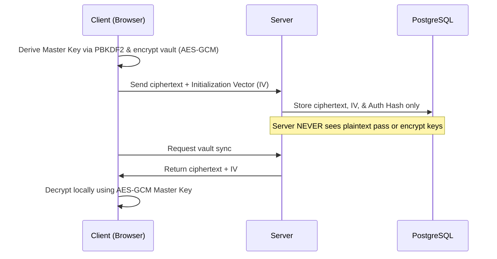

<div align="center">
  

  <p><strong>The Ultimate Zero-Knowledge Password Manager</strong></p>
  <p>Secure, end-to-end encrypted, and mathematically unbreakable.</p>

  <p>
    
    
    
    
    
    
  </p>

  <p>
    <a href="https://passwordstream.com"><strong>View Live Demo »</strong></a>
  </p>
</div>

<br/>

> [!WARNING]
> **Disclaimer:** This project was built for **demonstration and educational purposes only**. While it implements strong cryptographic principles, it has not been professionally audited. Do not use this application to store real, critical passwords without conducting your own security review.

## Table of Contents

- [About](#about)
- [Features](#features)
- [Technology Stack](#technology-stack)
- [Architecture](#architecture)
- [Getting Started](#getting-started)
- [Production Security Checklist](#production-security-checklist)
- [Community & Contributions](#community--contributions)
- [License](#license)

## About

PasswordStream is an open-source password manager built around a strict **Zero-Knowledge Architecture**. By combining `AES-GCM` symmetric encryption with `RSA-OAEP` asymmetric keypairs, PasswordStream ensures that even if the servers were fully compromised, stored data would remain mathematically impossible to read.

## Features

| Feature | Description |
|---|---|
| **End-to-End Encryption (E2EE)** | All passwords are encrypted locally on your device before they are ever transmitted to the server. |
| **Zero-Knowledge Architecture** | The server only stores cryptographic hashes of your master password. We cannot read your passwords, and we cannot recover them if you lose your master key. |
| **Hybrid Cryptography** | Combines symmetric (AES) and asymmetric (RSA) encryption to securely exchange vault keys during session initialization. |
| **SiteGate Protection** | An integrated security gateway that locks out unauthorized access before the application even boots. |

## Technology Stack

| Layer | Tools |
|---|---|
| Frontend | React, Vite, Vanilla CSS |
| Backend | Node.js, Express.js |
| Database | PostgreSQL |
| DevOps | Docker & Docker Compose |
| Security | Web Crypto API, bcrypt, JSON Web Tokens (JWT) |

## Architecture



## Getting Started

Run PasswordStream locally for development or testing.

### Prerequisites

- [Docker](https://www.docker.com/products/docker-desktop) and Docker Compose installed.

### Installation

**1. Clone the repository**

```bash
git clone https://github.com/f4-ice/passwordstream.git
cd passwordstream
```

**2. Configure environment variables**

Navigate to the backend folder and create your `.env` file:

```bash
cd passwordstream-backend
nano .env
```

**3. Fill in `.env`**

```bash
PORT=3000
DB_USER=passwordstream_user
DB_HOST=db
DB_NAME=passwordstream
DB_PASSWORD=your_secure_db_password_here
DB_PORT=5432
JWT_SECRET=your_secure_jwt_secret_key_here
SITE_PASSWORD=your_site_gate_password_here
```

**4. Start the application with Docker**

```bash
cd ..
docker compose up --build -d
```

**5. Access the application**

Frontend available at `http://localhost:8081`

> [!WARNING]
> **Secure Context Requirement:** The Web Crypto API strictly requires a Secure Context (HTTPS). If the context is not secure, the browser disables the cryptography features and the app will not let you create credentials. `localhost` is normally treated as secure, but if it isn't in your browser, enable it manually:
>
> Go to `chrome://flags/#unsafely-treat-insecure-origin-as-secure`, add `http://localhost:8081/`, then restart the browser.

## Production Security Checklist

Before deploying PasswordStream to a live environment, resolve the following:

### 1. Restrict CORS

**Problem:** `app.use(cors())` allows any website on the internet to send background API requests to the backend; a malicious site could trick a user's browser into deleting their account or stealing data.

**Fix:** Restrict the CORS origin in `server.js` to your production frontend domain only:

```javascript
app.use(cors({
  origin: 'https://www.your-production-domain.com'
}));
```

### 2. Secure Environment Variables

**Problem:** Variables like `JWT_SECRET` and database passwords can compromise your entire database and user tokens if leaked.

**Fix:** Keep `.env` out of version control. Confirm `.gitignore` includes `.env`. When deploying, use your hosting provider's secure environment variable dashboard (AWS, Render, Heroku, etc.) instead of committing secrets to the repo.

## Community & Contributions

Everybody is welcome to point out architectural flaws, cryptographic weaknesses, or general areas for improvement. Open an issue, submit a pull request, or fork the repository to build your own version. I'd love to see this application become one of the best open-source password managers of all time.

## License

Licensed under the [MIT License](LICENSE).

You are free to use this application for personal and commercial projects, **provided that credit is given** by linking back to this repository and including the copyright notice.
