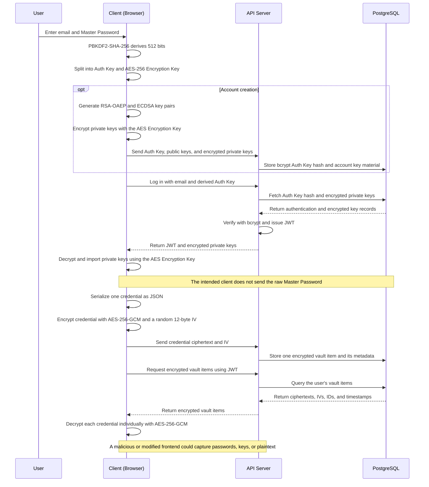

<div align="center">
  
  <p>
    
    
    
    
    
    
  </p>
<br/>

PasswordStream is an open-source, functional demo of a possible **zero-knowledge password manager product**, with client-side vault encryption, master-password rotation, and encrypted sharing.

It demonstrates how the main workflows of a real product could operate across a React frontend, Node.js API, and PostgreSQL database. The project has not received an independent security audit, so it should be treated as a product prototype rather than a production-ready service.

</div>

## What PasswordStream implements

- PBKDF2-SHA-256 with 600,000 iterations derives separate authentication and AES-256-GCM key material from the master password and normalized email.
- Each credential is serialized as its own JSON object and encrypted individually with AES-256-GCM in the browser before upload.
- RSA-OAEP and ECDSA private keys are stored encrypted with the master-derived AES key.
- Shares use a versioned hybrid envelope: AES-256-GCM encrypts the payload and RSA-OAEP wraps the random AES key. ECDSA signs the serialized envelope.
- Recipient RSA fingerprints can be verified out of band and are pinned on first use in the current browser. This detects later server-provided key changes, not a compromised first contact or modified frontend.
- Master-password changes re-encrypt both the complete vault and private sharing keys in one server-side database transaction.

The landing page also contains fictional prices and plans, a presentation-only Security and Data Notice, and a checkout placeholder. These elements are decorative product mockups: they do not constitute a commercial offer, process payments, create subscriptions, or provide real legal terms or a Privacy Policy.

## Architecture



## Threat model

### Protection provided by the architecture

For a **passive database disclosure**, vault payloads and private sharing keys remain encrypted if:

- the user chose a sufficiently strong master password;
- the browser loaded the intended, unmodified frontend;
- the endpoint and device were not compromised;
- the cryptographic implementations and application code behave as intended.

The database still exposes account metadata, email addresses, public keys, password-verifier hashes, ciphertext sizes, relationships, and timing metadata.

### Explicitly out of scope

This architecture does not protect plaintext or keys from:

- an active web-server compromise that serves modified JavaScript;
- a frontend build, dependency, CI, or supply-chain compromise;
- a malicious browser extension, endpoint malware, or compromised operating system;
- data captured while it is decrypted in browser memory;
- traffic interception when TLS is absent or compromised;
- public-key substitution on first contact when the fingerprint is not independently verified;
- weak master passwords and offline guessing against stolen authentication data.

“Database breach,” “server runtime compromise,” and “frontend compromise” are therefore different scenarios. This project does not claim that data is unreadable after a complete active server compromise.

## Security and compliance status

The project has not undergone an independent security audit, penetration test, privacy impact assessment, accessibility audit, or legal review. It makes no claim of GDPR, Costa Rican privacy-law, ISO, NIST, SOC 2, or other certification/compliance. See [SECURITY.md](SECURITY.md) for reporting and deployment expectations.

The API includes basic single-process rate limiting, restricted CORS, request-size limits from Express defaults, and security headers. The Nginx example adds a frontend Content Security Policy and related headers. A real deployment still needs TLS, centralized rate limiting, secrets management, monitoring, dependency scanning, backups, incident response, and professional review.

## Install and run locally

### Prerequisites

- [Git](https://git-scm.com/)
- [Docker Desktop](https://www.docker.com/products/docker-desktop/) or Docker Engine with Docker Compose

### 1. Clone the repository

```bash
git clone https://github.com/f4-ice/passwordstream.git
cd passwordstream
```

### 2. Configure the backend

Create a file named `passwordstream-backend/.env` with the following values:

```dotenv
PORT=3000
DB_USER=passwordstream_user
DB_HOST=db
DB_NAME=passwordstream
DB_PASSWORD=passwordstream_local
DB_PORT=5432
JWT_SECRET=replace_with_a_long_random_secret (min 32 characters)
ALLOWED_ORIGINS=http://localhost:5173,http://localhost:8081
# The included Docker setup places the API behind one Nginx proxy:
TRUST_PROXY=1
```

Generate a long random value for `JWT_SECRET`. The `DB_PASSWORD` value above matches the local default in `docker-compose.yml`; if you change one, change the other as well. Replace this local-development password for any shared environment.

### 3. Build and start PasswordStream

```bash
docker compose up --build
```

### 4. Open the application

Visit [http://localhost:8081](http://localhost:8081). Browsers normally treat `localhost` as a secure context, which is required by the Web Crypto API.

### 5. Stop the application

```bash
docker compose down
```

Use `docker compose down -v` only when you intentionally want to delete the local PostgreSQL volume and all locally stored accounts and vault data.

## Community & Contributions

Everybody is welcome to point out architectural flaws, cryptographic weaknesses, or general areas for improvement. Open an issue, submit a pull request, or fork the repository to build your own version. The long-term ambition is to help PasswordStream evolve into one of the strongest password manager projects possible.

## License

PasswordStream is distributed under the [MIT License](LICENSE). It permits anyone to use, copy, modify, merge, publish, distribute, sublicense, and sell copies of the software, including for commercial purposes. Copies or substantial portions must retain the original copyright notice and MIT permission notice. The license does not require users to contribute their modifications back to the project, and the software is provided without warranty.
